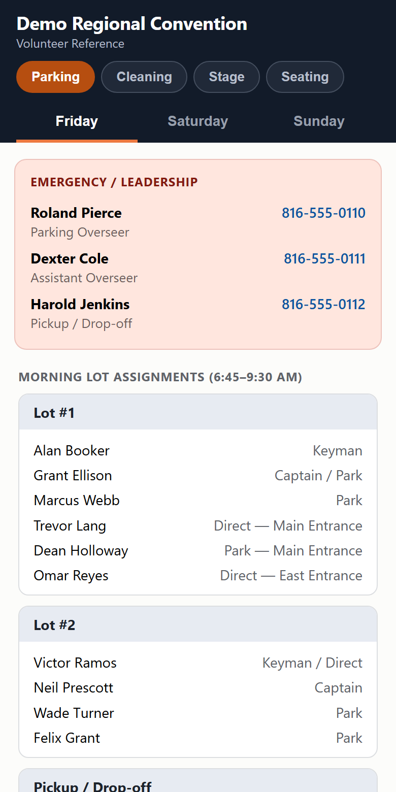

# Assembly Volunteer Info

A single-file, no-install tool for organizing volunteer information at multi-day
events (assemblies and conventions). Coordinators fill in departments, rosters,
schedules, contacts, notes, and maps in a friendly editor, then export one
self-contained HTML file that volunteers open on their phones — swipe between
departments, tap a day, tap a phone number to call, tap a map to zoom. No app,
no account, no internet needed after delivery.

## The two files

| File | What it is |
|---|---|
| [`Assembly Info Builder.html`](Assembly%20Info%20Builder.html) | The editor. Open it in any browser and start filling things in. Ships with a complete fictional demo event (Parking, Cleaning, Stage, Seating). |
| [`Demo Regional Convention - Volunteer Info.html`](Demo%20Regional%20Convention%20-%20Volunteer%20Info.html) | A sample of what the builder exports — the file volunteers receive. |

## Documentation

- **[README-HowTo.html](README-HowTo.html)** — illustrated step-by-step guide for
  non-technical users. Double-click it; it opens in the browser with screenshots.
- **[HANDOFF.md](HANDOFF.md)** — architecture and onboarding for developers/AI
  assistants: data model, section types, persistence, export mechanics, the
  security boundaries, and the non-obvious traps.
- **[JOURNAL.md](JOURNAL.md)** — dated change log. Add an entry for every change.

## Features

- **Groups (departments)** with flexible building-block sections: contact lists,
  per-day assignment rosters, time-slot schedules, notes (shared or per-day),
  image/map galleries, and searchable volunteer directories.
- **Swipe between days** in the volunteer file (Friday/Saturday/Sunday), tap a department to switch, tap-to-call and tap-to-WhatsApp.
- **Name autocomplete** everywhere, fed by the directories across all groups,
  with automatic phone and WhatsApp fill.
- **Distributed data entry**: each department captain edits their group in their
  own copy and exports it as a small JSON file; the coordinator imports it into
  the master. Images intentionally never travel in JSON (validated on import).
- **Images auto-compressed** on attach so exports stay text/email friendly.
- **Zero dependencies** — plain HTML/CSS/JS, no build step, works from `file://`.

## Privacy

All names and phone numbers in the demo data are fictional (phone numbers use
the reserved 555-01xx range). This repository must never contain real volunteer
names, phone numbers, or original event documents — the `.gitignore` is
deny-by-default for that reason. See the privacy rules in `HANDOFF.md`.
